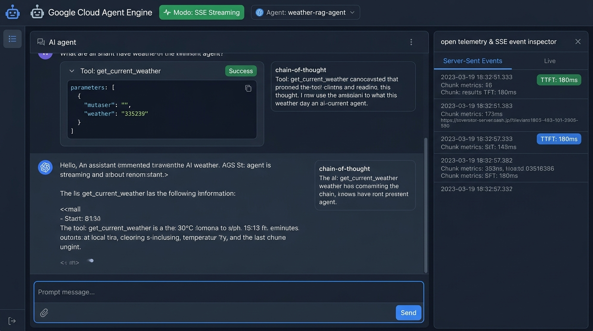
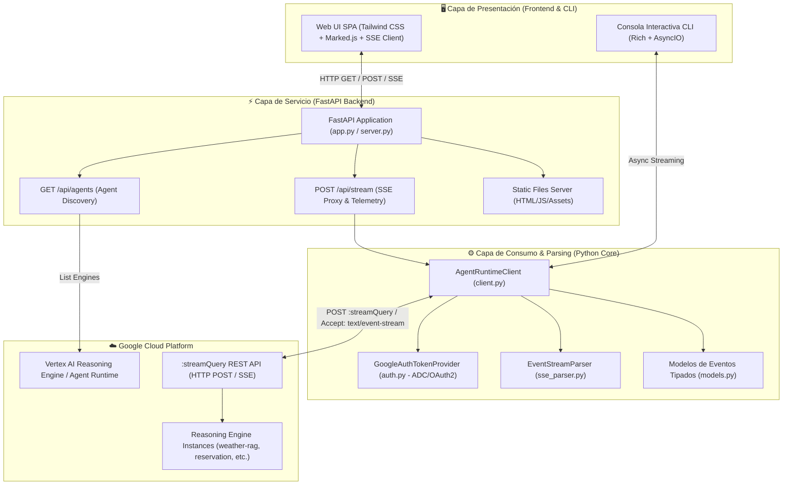
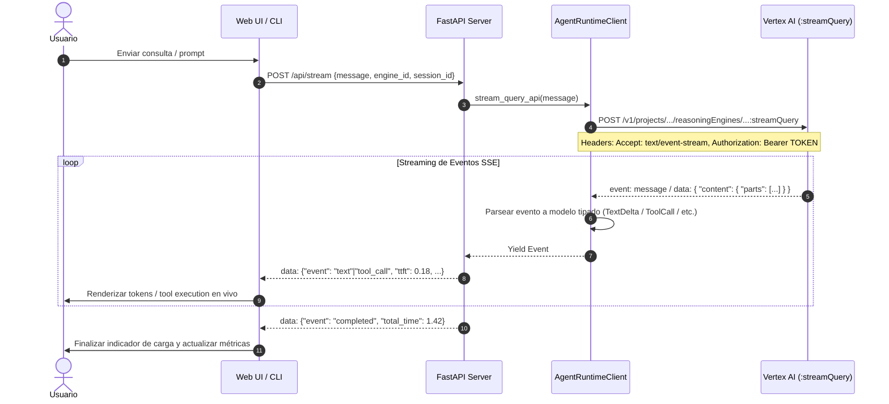

# Google Cloud Agent Engine / Agent Runtime — Streaming Consumer

Cliente Python y panel web interactivo de alto rendimiento para consumir agentes conversacionales desplegados en **Google Cloud Vertex AI Reasoning Engine (Agent Runtime / ADK)** mediante streaming continuo con **Server-Sent Events (SSE)** a través de la API REST `:streamQuery`.



---

## 🏗️ Arquitectura del Sistema

La solución está construida sobre una arquitectura modular desacoplada en capas, diseñada para garantizar baja latencia, streaming reactivo y observabilidad en tiempo real de los eventos generados por el agente.



### Componentes Principales

1. **Frontend Web SPA (`static/index.html`)**:
   - Interfaz moderna en modo oscuro desarrollada con Tailwind CSS, Marked.js (renderizado Markdown en vivo) y Lucide Icons.
   - **Receptor SSE nativo**: Lee y decodifica el stream de eventos línea a línea.
   - **Inspector de eventos y telemetría**: Muestra métricas de rendimiento en tiempo real (TTFT — *Time to First Token*, latencia total, conteo de chunks) y log detallado de Server-Sent Events.
   - **Renderizado de eventos enriquecidos**: Visualización diferenciada para llamadas a herramientas (`ToolCall`), resultados de ejecución (`ToolResult`), razonamiento (*Chain-of-Thought* / `ThoughtDelta`) y transferencias multi-agente (`AuthorTransfer`).

2. **Backend API Gateway (`src/server.py`)**:
   - Servidor asíncrono con **FastAPI** y **Uvicorn**.
   - `GET /api/config`: Proporciona la configuración del entorno para la interfaz de usuario.
   - `GET /api/agents`: Descubre y lista automáticamente los Reasoning Engines disponibles en el proyecto y región de GCP.
   - `POST /api/stream`: Orquesta la conexión hacia Vertex AI y emite un flujo SSE enriquecido hacia el navegador.

3. **Núcleo de Consumo y Autenticación (`src/`)**:
   - `GoogleAuthTokenProvider`: Gestión automática de credenciales mediante *Application Default Credentials* (ADC) y refresco dinámico de tokens OAuth2 (`Bearer`).
   - `AgentRuntimeClient`: Cliente HTTP asíncrono (`httpx`) con soporte de timeouts, streaming y gestión de sesiones multi-turno.
   - `EventStreamParser`: Parser tipado que transforma el flujo de bytes/JSON crudo en eventos estructurados de Pydantic (`TextDelta`, `ToolCall`, `ToolResult`, `ThoughtDelta`, `AuthorTransfer`, `StateDelta`, `DoneEvent`, `ErrorEvent`).

---

## 🔄 Flujo de Ejecución (Sequence Diagram)



---

## 🌟 Características

- 💬 **Streaming en Tiempo Real (Server-Sent Events / SSE)**:
  - Tokens de texto renderizados instantáneamente conforme son generados por el modelo.
  - Pasos de razonamiento (*Chain of Thought*) colapsables.
  - Llamadas a herramientas (`ToolCall`) con argumentos JSON interactivos.
  - Visualización estructurada de respuestas de herramientas (`ToolResult`).
  - Detección de delegación y transferencia entre agentes en arquitecturas multi-agente (`AuthorTransfer`).
- 🌐 **Consumo Directo vía API REST `:streamQuery`**:
  - Compatible con el endpoint estándar de Vertex AI Reasoning Engine.
  - No requiere SDKs pesados en el cliente para el consumo web.
- 🔍 **Selector Dinámico de Agentes**:
  - Descubre y conmuta en caliente entre distintos Reasoning Engines desplegados en tu proyecto de GCP.
- 📊 **Telemetría y Métricas en Vivo**:
  - Medición de *Time To First Token* (TTFT).
  - Tiempo total de respuesta y velocidad de transferencia.
- 🔐 **Autenticación Nativa de Google Cloud**:
  - Soporte para *Application Default Credentials* (ADC) y Cuentas de Servicio.
- 💻 **Múltiples Interfaces**:
  - Dashboard Web SPA (FastAPI + Tailwind).
  - CLI interactivo para terminal con Rich text.
  - Librería / SDK en Python reutilizable.

---

## 🚀 Inicio Rápido

### 1. Requisitos Previos
- Python >= 3.10
- Gestor de paquetes [`uv`](https://github.com/astral-sh/uv) (o `pip`)
- Google Cloud SDK (`gcloud`) configurado

### 2. Instalación de Dependencias
```bash
uv sync
```

### 3. Autenticación en Google Cloud
```bash
gcloud auth application-default login
```

### 4. Configuración de Variables de Entorno (`.env`)
Copia la plantilla de ejemplo y configura tu proyecto y región:
```bash
cp .env.example .env
```

Ejemplo de configuración (`.env`):
```env
GCP_PROJECT_ID=your-gcp-project-id
GCP_PROJECT_NUMBER=123456789012
GCP_LOCATION=us-central1
GCP_REASONING_ENGINE_ID=projects/123456789012/locations/us-central1/reasoningEngines/1234567890123456789
CLIENT_MODE=api
STREAMING_MODE=sse
AGENT_USER_ID=user-123
```

---

## 🖥️ Ejecución de la Aplicación

### Iniciar la Interfaz Web (FastAPI)
```bash
uv run python app.py
```
O con Uvicorn directamente:
```bash
uv run uvicorn app:app --host 0.0.0.0 --port 8000 --reload
```

Abre tu navegador en: **`http://localhost:8000`**

---

### Uso desde la Consola (CLI)

```bash
# Modo chat interactivo multi-turno
uv run agent-stream -i

# Consulta directa de una sola línea
uv run agent-stream "¿Cuáles son las ventajas de Server-Sent Events?"
```

---

## 🧪 Pruebas Unitarias

Ejecuta la suite de pruebas unitarias automatizadas con `pytest`:

```bash
uv run pytest
```

---

## 📁 Estructura del Proyecto

```text
.
├── app.py                            # Punto de entrada del servidor FastAPI
├── pyproject.toml                    # Configuración del paquete y dependencias
├── uv.lock                           # Lockfile reproducible de dependencias
├── .env.example                      # Plantilla de variables de entorno
├── docs/
│   └── assets/
│       └── ui_screenshot.jpg         # Captura de pantalla de la interfaz
├── src/
│   ├── __init__.py                   # Exportaciones principales del módulo
│   ├── auth.py                       # Proveedor de tokens OAuth2 / ADC
│   ├── cli.py                        # Interfaz de línea de comandos (CLI)
│   ├── client.py                     # Cliente AgentRuntimeClient
│   ├── config.py                     # Configuración validada con Pydantic Settings
│   ├── formatting.py                 # Formateadores de texto y consola Rich
│   ├── models.py                     # Modelos tipados de eventos SSE
│   ├── server.py                     # Endpoints FastAPI y generador de stream
│   └── sse_parser.py                 # Decodificador de Server-Sent Events
├── static/
│   └── index.html                    # Frontend SPA (Tailwind + SSE Client)
├── examples/                         # Scripts de ejemplo de integración
└── tests/                            # Pruebas unitarias automatizadas
```

---

## 📄 Licencia

Este proyecto está bajo la Licencia Apache 2.0. Consulta el archivo `LICENSE` para más información.
